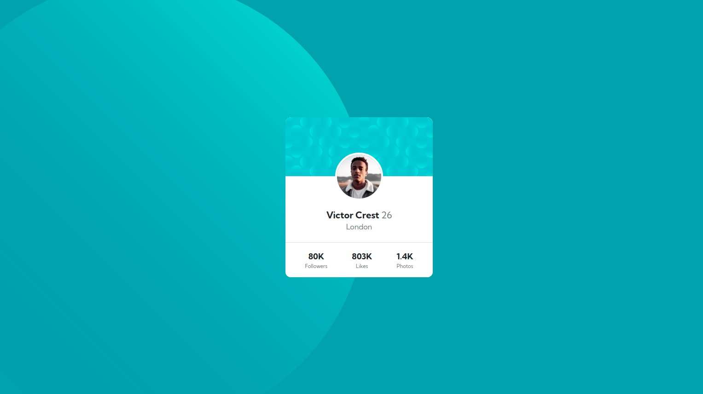

# Frontend Mentor - NFT preview card component solution

This is a solution to the [Profile card component challenge on Frontend Mentor](https://www.frontendmentor.io/challenges/profile-card-component-cfArpWshJ). Frontend Mentor challenges help you improve your coding skills by building realistic projects. 

## Table of contents

- [Overview](#overview)
  - [The challenge](#the-challenge)
  - [Screenshot](#screenshot)
- [Links](#links)
- [Built with](#built-with)
- [Author](#author)
- [Acknowledgments](#acknowledgments)


### The challenge

Users should be able to:

- View the optimal layout depending on their device's screen size


### Screenshot



### Links

- Live Site URL: [Page Link](https://xulab5.github.io/profile-card-component/)

### Built with

- Semantic HTML5 markup
- Bootstrap

To see how you can add code snippets, see below:

```html
 <div class="card text-center" style="width:20rem">
  <div class="card-header p-0">
    
  </div>
  
  <div class="card-body position-relative pt-5">
      <div class="profile-img position-absolute top-0 start-50 translate-middle rounded-circle">
          
      </div>
    <h5 class="card-title mt-4 fw-bolder">Victor Crest <span class="text-muted fw-normal">26</span></h5>
    <h6 class="card-subtitle mb-2 text-muted fw-normal">London</h6>
  </div>
  <div class="card-footer py-3 bg-white">
    <div class="info d-flex justify-content-around">
      <div class="data">
        <span class="fw-bolder">80K</span>
        <span class="text-muted fs-6 d-block">Followers</span>
      </div>
      <div class="data">
        <span class="fw-bolder">803K</span>
        <span class="text-muted fs-6 d-block">Likes</span>
      </div>
      <div class="data">
        <span class="fw-bolder">1.4K</span>
        <span class="text-muted fs-6 d-block"> Photos</span>
      </div>
    </div>
  </div>
</div>

  <div class="attribution">
    Challenge by <a href="https://www.frontendmentor.io?ref=challenge" rel="external nofollow"target="_blank">Frontend Mentor</a>. 
    Coded by <a href="https://stevensub.netlify.app/">Xulab</a>.
  </div>

      <!-- Option 1: Bootstrap Bundle with Popper -->
      <script src="https://cdn.jsdelivr.net/npm/bootstrap@5.0.2/dist/js/bootstrap.bundle.min.js" integrity="sha384-MrcW6ZMFYlzcLA8Nl+NtUVF0sA7MsXsP1UyJoMp4YLEuNSfAP+JcXn/tWtIaxVXM" crossorigin="anonymous"></script>

```


## Author

- Website - [Xulab](https://substeven.netlify.app/)
- Frontend Mentor - [@Xulab05](https://www.frontendmentor.io/profile/Xulab5)
- Instagram - [@Xulab05](https://www.instagram.com/xulab05/)

## Acknowledgments
I'd like to give thanks to Front-end for this awesome short project.

